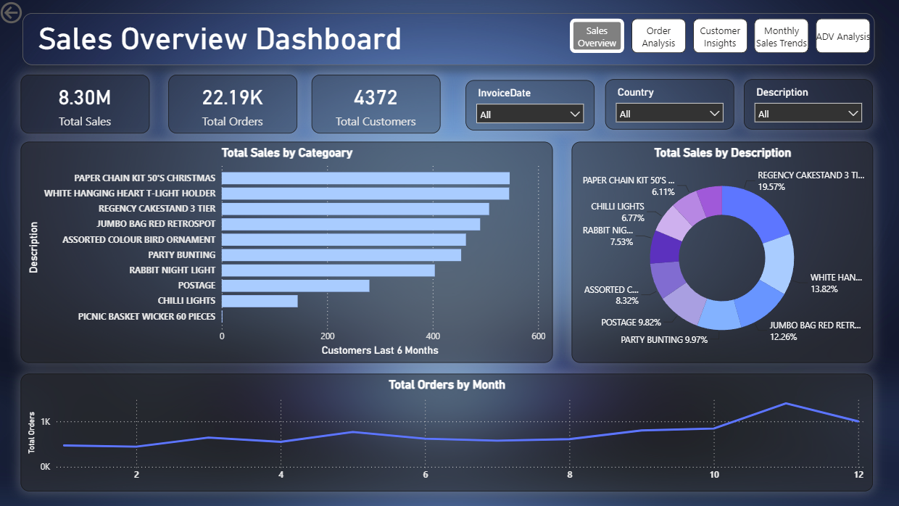
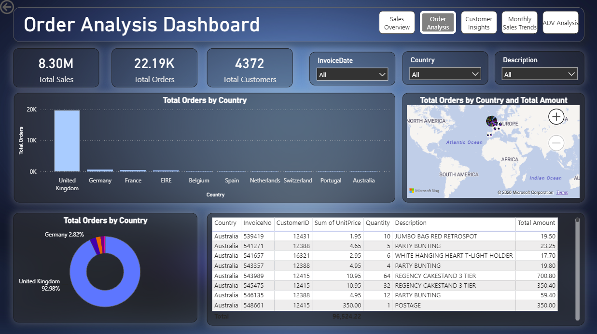
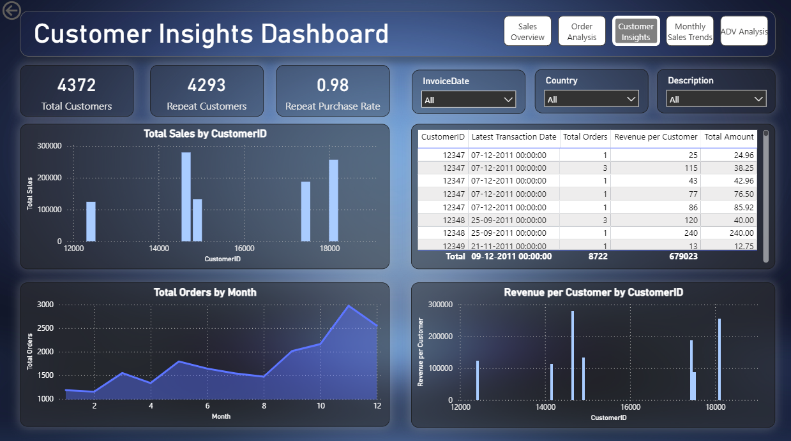
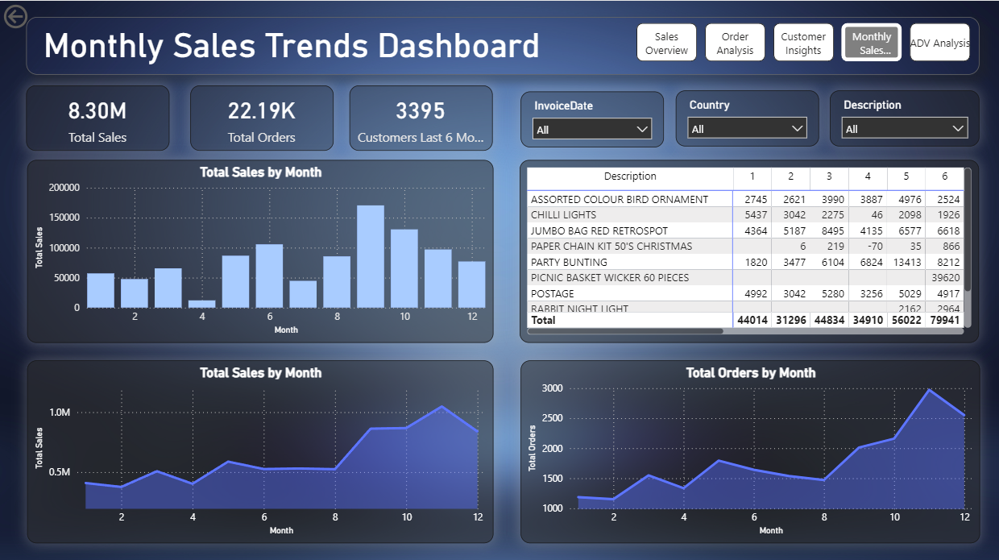
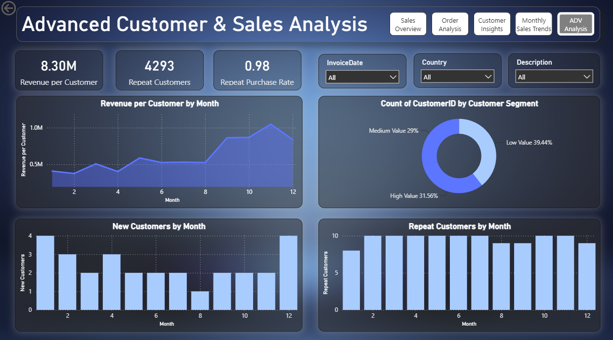

# 📊 Sales Analysis Dashboard — Scooby Doo LLP


> A multi-page interactive **Power BI Sales Dashboard** built on retail transaction data for **Scooby Doo LLP**, covering sales performance, order trends, customer behavior, and advanced segmentation analytics.

---

## 📁 Repository Structure

```
Sales-Analysis-PowerBI/
│
├── 📂 dataset/
│   └── Sales_Data_Scooby_Doo_LLP.xlsx     # Raw transactional dataset (1000 records)
│
├── 📂 report/
│   └── Sales_Analysis.pbix                 # Main Power BI report file (5 pages)
│
├── 📂 screenshots/
│   ├── 01_sales_overview.png               # Sales Overview Dashboard
│   ├── 02_order_analysis.png               # Order Analysis Dashboard
│   ├── 03_customer_insights.png            # Customer Insights Dashboard
│   ├── 04_monthly_sales_trends.png         # Monthly Sales Trends Dashboard
│   └── 05_advanced_analysis.png            # Advanced Customer & Sales Analysis
│
└── README.md
```

---

## 🧾 Project Overview

This project performs **end-to-end sales analysis** on transactional retail data for Scooby Doo LLP using **Microsoft Power BI**. The workflow covers raw data ingestion from Excel, data transformation using **Power Query**, custom KPI creation using **DAX**, and visual storytelling across **5 interactive dashboard pages**.

### 📦 Dataset Summary

| Attribute | Detail |
|---|---|
| **File** | `Sales_Data_Scooby_Doo_LLP.xlsx` |
| **Records** | 1,000 transactions |
| **Fields** | Order ID, Order Date, Customer ID, Customer Name, Product ID, Category, Product Name, Quantity, Unit Price, Order Status, Total Price |
| **Categories** | Electronics, Sports, Home & Kitchen, Books, Toys, Clothing |
| **Order Statuses** | Delivered, Shipped, Returned |

---

## 🛠️ Skills & Tools Used

| Skill / Tool | What I did with it |
|---|---|
| **Power BI Desktop** | Built all 5 dashboard pages with interactive visuals |
| **Power Query (M Language)** | Cleaned data, handled nulls, parsed dates, derived new columns |
| **DAX (Data Analysis Expressions)** | Wrote custom measures for KPIs, segmentation, and time-based calculations |
| **Microsoft Excel** | Source data preparation and structure |
| **Data Modelling** | Defined relationships and schema for efficient querying |
| **Data Visualization** | Bar charts, donut charts, line charts, map visuals, matrix tables, KPI cards |
| **UX / Dashboard Design** | Page navigation buttons, consistent dark theme, slicer sync across pages |

---

## 📊 Dashboard Pages

### 1. 🛍️ Sales Overview Dashboard
**Goal:** High-level snapshot of business performance

- KPI Cards: Total Sales (8.30M), Total Orders (22.19K), Total Customers (4,372)
- Horizontal bar chart — Top products by sales (Total Sales by Category)
- Donut chart — Revenue share by product description
- Line chart — Total Orders trend across 12 months
- Slicers: Invoice Date · Country · Description

**Screenshot:**



---

### 2. 🌍 Order Analysis Dashboard
**Goal:** Understand where orders are coming from geographically

- Bar chart — Total Orders by Country (UK dominates at ~93%)
- Bing Map visual — Orders plotted by country with bubble sizing
- Donut chart — Country-wise order share
- Detail table — Invoice-level breakdown: Country, Invoice No., Customer ID, Quantity, Description, Total Amount

**Screenshot:**



---

### 3. 👤 Customer Insights Dashboard
**Goal:** Understand customer value and purchase behaviour

- KPI Cards: Total Customers (4,372) · Repeat Customers (4,293) · Repeat Purchase Rate (0.98)
- Bar chart — Total Sales by CustomerID
- Line chart — Total Orders by Month
- Bar chart — Revenue per Customer by CustomerID
- Summary table — CustomerID, Latest Transaction Date, Total Orders, Revenue per Customer, Total Amount

**Screenshot:**



---

### 4. 📅 Monthly Sales Trends Dashboard
**Goal:** Identify seasonality and month-on-month performance

- Bar chart — Total Sales by Month (peak at Month 10)
- Area line chart — Cumulative sales trend
- Line chart — Total Orders by Month
- Matrix table — Product × Month pivot showing quantity sold per product per month (with negative values for returns visible)

**Screenshot:**



---

### 5. 🔬 Advanced Customer & Sales Analysis
**Goal:** Segment customers and analyse retention patterns

- Line chart — Revenue per Customer by Month
- Donut chart — Customer Segmentation: High Value (31.56%), Medium Value (29%), Low Value (39.44%)
- Bar chart — New Customers acquired per Month
- Bar chart — Repeat Customers per Month
- KPI Cards: Revenue per Customer · Repeat Customers · Repeat Purchase Rate

**Screenshot:**



---

## 🔑 Key DAX Measures Written

```dax
-- Total Sales
Total Sales = SUM(Sales[Total Price ($)])

-- Total Orders
Total Orders = DISTINCTCOUNT(Sales[Order ID])

-- Total Customers
Total Customers = DISTINCTCOUNT(Sales[Customer ID])

-- Repeat Customers
Repeat Customers =
CALCULATE(
    DISTINCTCOUNT(Sales[Customer ID]),
    FILTER(
        SUMMARIZE(Sales, Sales[Customer ID], "OrderCount",
                  DISTINCTCOUNT(Sales[Order ID])),
        [OrderCount] > 1
    )
)

-- Repeat Purchase Rate
Repeat Purchase Rate = DIVIDE([Repeat Customers], [Total Customers])

-- Revenue per Customer
Revenue per Customer = DIVIDE([Total Sales], [Total Customers])

-- Customers Last 6 Months
Customers Last 6 Months =
CALCULATE(
    DISTINCTCOUNT(Sales[Customer ID]),
    DATESINPERIOD(Sales[Order Date], LASTDATE(Sales[Order Date]), -6, MONTH)
)

-- Customer Segment (Calculated Column)
Customer Segment =
VAR Rev = [Revenue per Customer]
RETURN
    IF(Rev >= 5000, "High Value",
       IF(Rev >= 1000, "Medium Value", "Low Value"))
```

---

## 📈 Key Business Insights

| Insight | Finding |
|---|---|
| 💰 **Total Revenue** | 8.30M across all categories |
| 🔁 **Customer Loyalty** | 98% repeat purchase rate — extremely high retention |
| 🌍 **Geographic Concentration** | UK accounts for ~93% of all orders |
| 📅 **Peak Season** | Months 9–11 show the highest sales and order volume |
| 🏆 **Top Revenue Product** | Regency Cakestand 3 Tier — 19.57% of total sales |
| 📉 **Returns Issue** | Negative values in Month 4 (Paper Chain Kit) indicate return/cancellation spikes |
| 👥 **Customer Segments** | 31.56% High Value · 29% Medium Value · 39.44% Low Value |
| 🛒 **Top Category** | Electronics and Sports drive the highest transaction volumes |

---

## 🚀 How to Run This Project

### Prerequisites
- [Power BI Desktop](https://powerbi.microsoft.com/desktop/) (free)

### Steps

```bash
# 1. Clone this repository
git clone https://github.com/your-username/Sales-Analysis-PowerBI.git
cd Sales-Analysis-PowerBI
```

2. Open **Power BI Desktop**
3. Open `report/Sales_Analysis.pbix`
4. If the data source path breaks → go to `Home > Transform Data > Data Source Settings` → update path to your local `dataset/` folder
5. Use the **navigation buttons** (top-right of each page) to switch between dashboards
6. Use **slicers** (Invoice Date · Country · Description) to filter interactively

---

## 🙋‍♂️ About Me

**Kalp**
Computer Engineering Student — 6th Semester
C.K. Pithawala College of Engineering & Technology (GTU), Surat

> Passionate about Data Analytics, Machine Learning, and building end-to-end data applications.

[](https://linkedin.com/in/your-profile)
[](https://github.com/your-username)

---

## 📄 License

This project is open source and available under the [MIT License](LICENSE).
